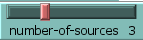
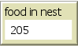
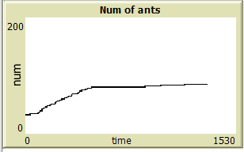
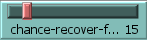
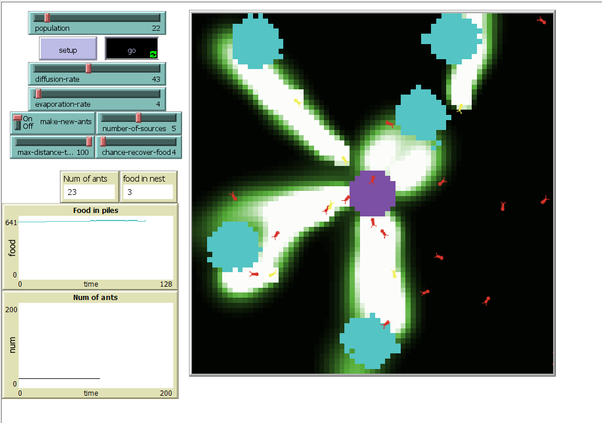
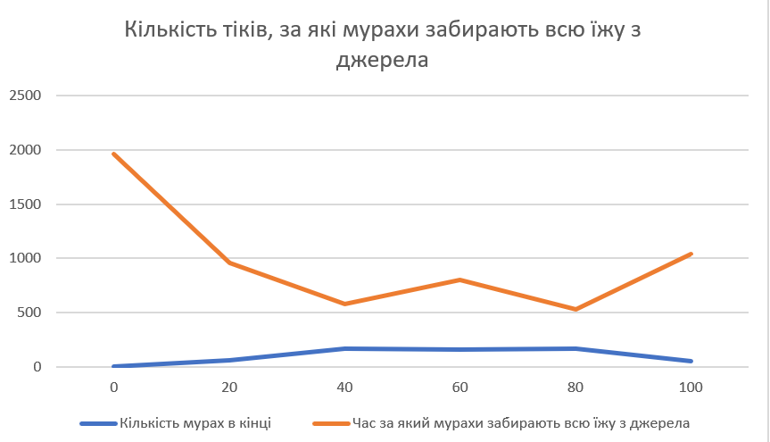

## Комп'ютерні системи імітаційного моделювання
## СПм-22-3, **Коломоєць Владислав Сергійович**
### Лабораторна робота №**2**. Редагування імітаційних моделей у середовищі NetLogo

### Варіант 10, модель у середовищі NetLogo:
[Ants](https://www.netlogoweb.org/launch#http://www.netlogoweb.org/assets/modelslib/Sample%20Models/Biology/Ants.nlogo)

 

### Внесені зміни у вихідну логіку моделі, за варіантом:

**Додати можливість вказувати кількість джерел їжі на полі** 

Змінено процедуру встановлення патчів. Тепер джерела їжі встановлюються на полі випадково. Їх кількість визначається слайдером "number-of-sources".
<pre>
  to setup-patches
  repeat number-of-sources [
    let rand-x ((random-float 2) - 1) * max-pxcor
    let rand-y ((random-float 2) - 1) * max-pycor
    ask patches [
      setup-food rand-x rand-y
    ]
  ]

  ask patches [
    setup-nest
    recolor-patch
  ]
end
</pre>

Повністю змінено процедуру setup-food та видалено властивість патчу "food-source-number". Адже тепер джерела їжі не відрізняються один від одного. 
Розмір кожного джерела не змінився.
<pre>
  to setup-food [x y]
  if distancexy (x) (y) < 5 [
    set food one-of [1 2]
  ]
end
</pre>

Змінено процедуру recolor-patch. Оскільки тепер всі джерела їжі одинакові, то у них один колір. І патчі зафарбовуються тільки, якщо в них є якась кількість їжі.
<pre>
  to recolor-patch
  ifelse nest? [
    set pcolor violet
  ] [
    ifelse food > 0 [
      set pcolor cyan
    ] [
      set pcolor scale-color green chemical 0.1 5
    ]
  ]
end
</pre>

Щоб надати можливість користувачеві вказувати кількість джерел їжі на полі, був доданий відповідний слайдер:

Також додано можливість вказувати за допомогою слайдера максимальну відстань джерел їжі від мурашника.
                  
**Додати показник кількості зібраної їжі у гнізді, що відображається користувачеві:**

Створено глобальну змінну, яка відповідає за підрахунок принесеної у гніздо їжі.
<pre>
  globals[
  food-in-nest ;;food counter
]
 </pre>

Тепер коли мурахи повертаються у гніздо лічільник їжі у гнізді збільшується на одиницю.
 <pre>
to return-to-nest  ;; turtle procedure
  ifelse nest?
  [ ;; drop food and head out again
    set color red
    set food-in-nest food-in-nest + 1 ;;food counter
    rt 180 ]
  [ set chemical chemical + 60  ;; drop some chemical
    uphill-nest-scent ]         ;; head toward the greatest value of nest-scent
end
</pre>

Для відображення кількості їжі створено відповідний монітор у інтерфейсі:

**Додати відключаєму можливість появи нових мурах за умов наявності достатньої кількості їжі у гнізді**

Додано глобальні змінні: carrying-capacity, reproduce-chance. 
<pre>
  globals[
  food-in-nest
  carrying-capacity ;; max num of turtles
  reproduce-chance  ;; the probability of a nest generating an offspring each tick
]
</pre>

Створено нову процедуру "create-ant". Якщо в гнізді більше 5 одиниць їжі і ще не досягнуто максимальної кількості мурах, то є можливість створити нову мураху у гнізді. При створенні нової мурахи з гнізда забирається 5 одиниць їжі.
<pre>
;; If there are less turtles than the carrying-capacity
;; then turtles can reproduce.
to create-ant
  if food-in-nest > 5 and count turtles < carrying-capacity  [
    set food-in-nest food-in-nest - 5
   create-turtles 1
  [ set size 2         ;; easier to see
    set color red  ]
  ]
end
</pre>

Змінено процедуру "go". Тепер з кожним тіком визначається, чи є можливість створити мураху. Якщо є, то з 10% шансом вона створиться на цьому тікі.
<pre>
  to go
  ...
    if make-new-ants and random-float 100 < reproduce-chance[
    create-ant
  ]
  ...
</pre>

Додано до інтерфейсу перемикач, який дозволяє або забороняє створення нових мурах:

**Додати графік зміни кількості мурах.**

Графік зміни кількості мурах:

### Внесені зміни у вихідну логіку моделі, на власний розсуд:

**Відновлення запасів їжі на полі**

Створено нову процедуру spread-food для обробки розповсюдження їжі від джерел із їжею до сусідніх патчів:
<pre>
to spread-food
  ask patches with [food > 0] [
    let available-neighbors neighbors with [food = 0]
    if any? available-neighbors [
      let spread-amount 1
      ask available-neighbors [
          if random-float 100 < chance-recover-food / 100 [set food food + spread-amount]
      ]
    ] 
  ]
end
</pre>

Створено відповідний слайдер для неї, який регулює шанс відновлення їжі. Також його можна розглядати як швидкість відновлення їжі:

**Старіння та смерть мурах**

Щоб мурахи з часом гинули у моделі NetLogo, запроваджено механізм старіння та видалення мурах, коли вони досягають певного віку.
Створено атрибут мурах, який відповідає за вік:
<pre>
  age  ;; age of the ant
</pre>

Налаштовано процедуру create-ant, щоб встановити початковий вік новостворених мурах:
<pre>
  to create-ant
  if food-in-nest > 5 and count turtles < carrying-capacity [
    set food-in-nest food-in-nest - 5
    create-ants 1 [
      set size 2
      set color red
      set age 0  ;; Set the initial age to 0
    ]
  ]
end
</pre>

Змінено процедуру go, щоб включити старіння та видалити мурашок, коли вони досягнуть певного віку:
<pre>
  to go
  ask turtles [
    if who >= ticks [ stop ] ;; delay initial departure
    ifelse color = red [
      look-for-food   ;; not carrying food? look for it
    ] [
      return-to-nest  ;; carrying food? take it back to nest
    ]
    wiggle
    fd 1
    set age age + 1  ;; Increase the age of the ant
    if age >= max-ant-age [
      die  ;; Remove ants when they reach a certain age
    ]
  ]

  ; ... (other code)

  tick
end
</pre>

Визначено глобальну змінну max-ant-age, щоб встановити максимальний вік, якого може досягти мураха:
<pre>
  globals [
  food-restoration-rate ;; rate at which food is restored on patches
  max-ant-age           ;; maximum age an ant can reach
  ; ... (other global variables)
]
</pre>

З цими модифікаціями мурахи з часом старітимуть, і коли вони досягнуть максимального віку, визначеного max-ant-age, вони помруть і будуть вилучені з симуляції. 

Фінальний код моделі та її інтерфейс доступні за [посиланням](Ants2.nlogo). 
 

## Обчислювальні експерименти
### 1. Вплив дифузії феромонів на швидкість збору кожного джерела їжі
Досліджується залежність сили дифузії на швидкість та ефективність збору їжі.
Експерименти проводяться при 0-100 значення дифузії, з кроком 20, усього 6 симуляцій.  
Інші керуючі параметри мають значення за замовчуванням:
- **population**: 100
- **evaporation-rate**: 10
- **make-new-ants**: on
- **number-of-sources**: 3
- **max-distance-to-nest**: 100%
- **chance-recover-food**: 0%

Кількість тіків, за які мурахи забирають всю їжу з джерела
<table>
<thead>
<tr><th>Значення дифузії</th><th>Кількість мурах в кінці</th><th>Час за який мурахи забирають всю їжу з джерела</th></tr>
</thead>
<tbody>
<tr><td>0</td><td>5</td><td>1920</td></tr>
<tr><td>20</td><td>60</td><td>960</td></tr>
<tr><td>40</td><td>167</td><td>580</td></tr>
<tr><td>60</td><td>157</td><td>800</td></tr>
<tr><td>80</td><td>170</td><td>530</td></tr>
<tr><td>100</td><td>50</td><td>1040</td>></tr>
</tbody>
</table>

- Вплив дифузії феромонів: З збільшенням значення дифузії феромонів (від 0 до 100) спостерігається загальна тенденція до збільшення кількості мурах в кінці експерименту і зменшення часу, за який вони забирають всю їжу з джерела. Це свідчить про те, що високий рівень дифузії феромонів поліпшує ефективність збору їжі.
-Оптимальне значення дифузії: За результатами дослідження можна вважати, що оптимальним значенням дифузії феромонів є десь навколо 40-60. На цьому інтервалі досягається найвища швидкість збору їжі.
-Кількість мурах в кінці експерименту: З високим значенням дифузії (100) кількість мурах в кінці експерименту менша, що може бути пов'язано зі зміною стратегії збору їжі в мурах. Адже чим нижча швидкість збору, тим менше в гнізді їжі і тим повільніше відроджуються мурахи.

